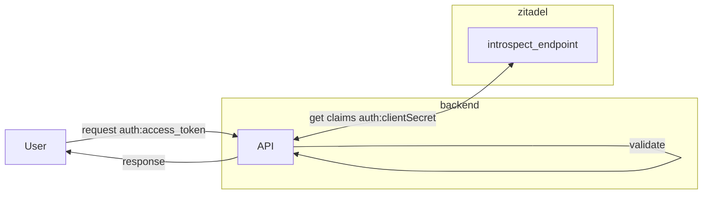

# Example: Python3 Flask API Authentication and Authorization

This example shows you how to create a Python3 API using Flask.

## Overview

The API will have a public, private, and private-scoped route and check if a user is authenticated and authorized to access the routes.
Our private routes expect an authorization header with an valid access_token in the request.
The API will validate the access_token on the [introspect endpoint](https://zitadel.com/docs/apis/openidoauth/endpoints#introspection_endpoint) and receives the user's roles.

The API application uses [Client Secret Basic](https://zitadel.com/docs/apis/openidoauth/authn-methods#client-secret-basic) to authenticate against ZITADEL and access the introspection endpoint.
You can use any valid access_token from a user or service account to send requests to the example API.
In this example we will use a service account with a [personal access token](https://zitadel.com/docs/guides/integrate/pat) which can be used directly to access the example API.



## Running the example

In order to run the example you need to have `python3` and `pip` installed.

### ZITADEL configuration

You need to setup a couple of things in ZITADEL. If you don't have an instance yet, please go ahead and create an instance following our [Get Started Guide](https://zitadel.com/docs/guides/start/quickstart).

#### 1. Create an application

Follow [our guide](https://zitadel.com/docs/guides/manage/console/applications) to create a new application with type "API" and authentication method "Basic".

Save both the ClientID and ClientSecret.

#### 2. Create a service user and PAT

Follow [our guide](https://zitadel.com/docs/guides/manage/console/users#create-user) to create a service user.

Create a personal access token, following [this guide](https://zitadel.com/docs/guides/integrate/pat#create-a-service-user-with-a-pat). No need to add the the user as manager.

#### 3. Authorization

Follow [this guide](https://zitadel.com/docs/guides/manage/console/roles) to create a role `read:messages` on your project.

Authorize the service user, by adding the role `read:messages` to the user.

### Client configuration

You just need to create a file named `.env` in the directory.
There is in example configuration in the `.env.example` file. 

Set the values with the Instance Domain, Client ID, and Client Secret from the previous steps, and the client should work.

### Start the service

1. Install required dependencies with `pip install -r requirements.txt`
2. Start the server with `python3 server.py`
3. Open another terminal and follow the next step to test the API

## Testing the API

### Public route

Try calling the public route

```
curl --request GET \
    --url http://127.0.0.1:5000/api/public
```

You should get a response with Status Code 200 and the following message.

`{"message":"Public route - You don't need to be authenticated to see this."}`

### Private route

Try calling the private route without authorization headers

```
curl --request GET \
    --url http://127.0.0.1:5000/api/private
```

You should get a response with Status Code 401 and an error message.

So let's add an authorization header to your request. Save the personal access token for your service user to a variable. 

`PAT=nr9vnUTkQkn4rxWk...`

Then call the private route with the PAT in the authorization header.

```
curl --request GET \
    --url http://127.0.0.1:5000/api/private \
    --header "authorization: Bearer $PAT"
```

Now you should get a response with Status Code 200 and the following message.

`{"message":"Private route - You need to be authenticated to see this."}`

### Private route, protected

Try calling the private route that requires the user to have a certain role

```
curl --request GET \
    --url http://127.0.0.1:5000/api/private-scoped \
    --header "authorization: Bearer $PAT"
```

You should get a response with Status Code 200 and the following message. 

`{"message":"Private, scoped route - You need to be authenticated and have the role read:messages to see this."}`

You can remove the role from the service user in ZITADEL and try again. You should then get Status Code 401, unauthorized.
